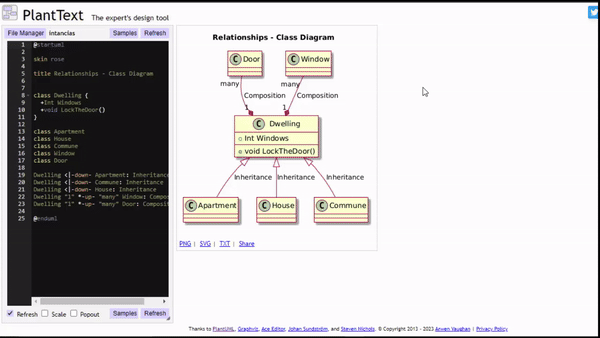
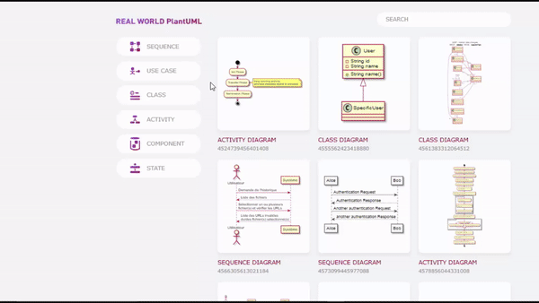

# ❓ O que é o PlantUML?
  
PlantUML é uma ferramenta que permite criar diagramas UML de forma textual. Com uma sintaxe simples e poderosa, é possível gerar diagramas de classes, sequência, atividades, componentes, entre outros.

- [❓ O que é o PlantUML?](#-o-que-é-o-plantuml)
  - [🆚 Comparação entre uma ferramenta comum de diagramação e o PlantUML](#-comparação-entre-uma-ferramenta-comum-de-diagramação-e-o-plantuml)
  - [💻 Instalação](#-instalação)
  - [Integração com IDEs](#integração-com-ides)
  - [🛠️ Ferramenta web](#️-ferramenta-web)
    - [PlantUML Online (Versão Web)](#plantuml-online-versão-web)
    - [PlantText: plataforma alternativa](#planttext-plataforma-alternativa)
  - [📝 Exemplos da web](#-exemplos-da-web)
    - [Real World PlantUML](#real-world-plantuml)
  - [📊 Exemplos de diagramas](#-exemplos-de-diagramas)
  - [📁 Revisão rápida](#-revisão-rápida)

## 🆚 Comparação entre uma ferramenta comum de diagramação e o PlantUML

Ferramentas comuns de diagramação são ideais para quem prefere um ambiente gráfico, com foco em simplicidade e facilidade de uso. Já o PlantUML é uma ferramenta poderosa para usuários técnicos que desejam automação, colaboração eficiente (especialmente em projetos de software) e alta flexibilidade na geração de diagramas complexos a partir de código.

## 💻 Instalação 

Para utilizar o PlantUML, você precisa ter o Java instalado. Em seguida, faça o download do PlantUML a partir do [site oficial](https://plantuml.com/starting).

## Integração com IDEs

PlantUML tem suporte para diversas IDEs como Eclipse, IntelliJ IDEA e Visual Studio Code. Verifique os plugins disponíveis para facilitar o uso dentro do seu ambiente de desenvolvimento.

## 🛠️ Ferramenta web

### PlantUML Online (Versão Web)

Acesse o PlantUML Web: Você pode acessar a versão online através do link oficial: [PlantUML Versão web](https://www.plantuml.com/plantuml/uml/SyfFKj2rKt3CoKnELR1Io4ZDoSa70000).

### PlantText: plataforma alternativa

[PlantText](https://www.planttext.com/) é outra ferramenta online que permite criar e visualizar diagramas UML de forma rápida e simples. Ele utiliza a mesma sintaxe do PlantUML e é uma excelente opção para quem deseja uma interface amigável e focada exclusivamente em diagramas UML sem ter que fazer nenhuma instalação .

## 📝 Exemplos da web 

### Real World PlantUML 

O site [Real World PlantUML](https://real-world-plantuml.com/) dedicado a fornecer exemplos práticos de diagramas UML feitos com PlantUML. Se você está procurando inspiração ou exemplos prontos para usar em seus projetos, o Real World PlantUML é um excelente alternativa.

## 📊 Exemplos de diagramas

Nesse diretório possui diagramas de alguns estudos.

[Exemplos](https://github.com/FabioFlorencio/plantUML/tree/master/exemplos)

## 📁 Revisão rápida

Nesse diretório possui uma tabela de revisão sobre as principais sintaxes do plantUML.

[Revisão rápida](https://github.com/FabioFlorencio/plantUML/tree/master/revisao-rapida)
