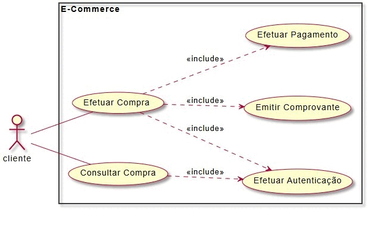

# 📊 Diagramas 📐

Aqui está alguns modelos de diagramas que foi criado com o objetivo de organizar e compartilhar diagramas que ajudam a ilustrar e documentar diferentes conceitos, processos ou arquiteturas. 

## 📂 Principais diagramas

### 📂 Estrutura do Repositório

Os diagramas estão organizados em pastas com base em seus contextos ou finalidades.

- [Diagramas de AWS](https://github.com/FabioFlorencio/plantUML/tree/master/diagramas/aws)
- [Diagramas de Casos de Uso](https://github.com/FabioFlorencio/plantUML/tree/master/diagramas/caso-de-uso)
- [Diagramas de Classe](https://github.com/FabioFlorencio/plantUML/tree/master/diagramas/class)
- [Diagramas de Componentes](https://github.com/FabioFlorencio/plantUML/tree/master/diagramas/component)
- [Diagramas de Deployment](https://github.com/FabioFlorencio/plantUML/tree/master/diagramas/deployment)
- [Diagramas de Pacotes e Componentes](https://github.com/FabioFlorencio/plantUML/tree/master/diagramas/pacotes-e-componentes)
- [Diagramas Retângulo](https://github.com/FabioFlorencio/plantUML/tree/master/diagramas/rectangle)
- [Diagramas de Sequência](https://github.com/FabioFlorencio/plantUML/tree/master/diagramas/sequencia)

