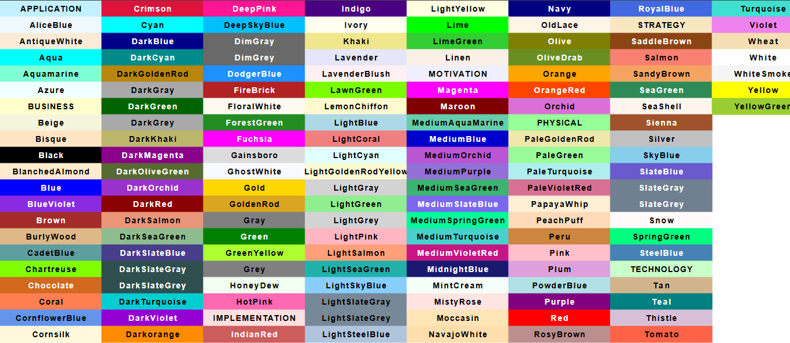
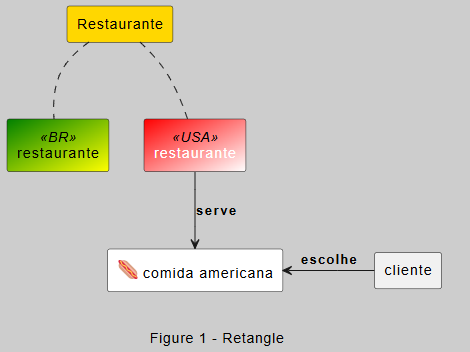

# 📋 Tabela de revisão rápida ⚡


Aqui está uma tabela de revisão sobre as principais sintaxes do plantUML.


- [📋 Tabela de revisão rápida ⚡](#-tabela-de-revisão-rápida-)
  - [🌐 Comandos gerais](#-comandos-gerais)
    - [HTML](#html)
    - [Markdown](#markdown)
    - [Comentários](#comentários)
    - [Caracteres Especiais](#caracteres-especiais)
    - [Funções](#funções)
    - [Tipos de Linhas\\Setas gerais](#tipos-de-linhassetas-gerais)
      - [Linha\\Setas sem estilo](#linhasetas-sem-estilo)
      - [Linha\\Setas com estilo](#linhasetas-com-estilo)
      - [Exemplo](#exemplo)
        - [Código](#código)
        - [Diagrama](#diagrama)
    - [🧭 Direção dos elementos](#-direção-dos-elementos)
    - [🖌️ Design](#️-design)
      - [Cores](#cores)
      - [Exemplo de aplicação de cores](#exemplo-de-aplicação-de-cores)
        - [Código](#código-1)
        - [Diagrama](#diagrama-1)
      - [Skinparam](#skinparam)
      - [Skinparam UML](#skinparam-uml)
        - [UML 1 E 2](#uml-1-e-2)
      - [Skinparam nativo](#skinparam-nativo)
      - [Themes](#themes)
      - [Icons](#icons)
        - [Logos](#logos)
        - [Tupadr3/devicons](#tupadr3devicons)
        - [Office](#office)
        - [Devices](#devices)
        - [Material](#material)
        - [AWS](#aws)
          - [Geral](#geral)
          - [Verde - aws.cost](#verde---awscost)
          - [Azul - aws.database](#azul---awsdatabase)
          - [Rosa - aws.management|aws.integration](#rosa---awsmanagementawsintegration)
          - [Azul - aws.devtools](#azul---awsdevtools)
          - [Laranja - aws.compute](#laranja---awscompute)
          - [Roxo - aws.network|aws.analytics](#roxo---awsnetworkawsanalytics)
          - [Container image](#container-image)
  - [🗂️ Diagramas](#️-diagramas)
    - [📚 Class](#-class)
    - [🔲 Retângulo](#-retângulo)
      - [Retângulo: Principais sintaxes](#retângulo-principais-sintaxes)
    - [📦 Component](#-component)
      - [Component: Principais sintaxes](#component-principais-sintaxes)
      - [Linhas | Setas](#linhas--setas)
  - [⏰ Dicas de produtividade](#-dicas-de-produtividade)
    

## 🌐 Comandos gerais 

### HTML

| Estilo de texto |  Tags                                          |
|:----------------|:-----------------------------------------------|
|`Negrito`        | `<b>texto</b>`                                 |
|`Sublinhado`     | `<u>texto sublinhado</u>`                      |
|`Tachado`        | `<s>texto tachado</s>`                         |
|`size`           | `<size:20>Aumenta o tamanho da fonte</size:20>`|
|`font`           | `<font color=red>Warning:</font>`              |

### Markdown

| Estilo de texto |  Sintaxe                       |
|:----------------|:-------------------------------|
|`Itálico`        | ``//italics//``                |
|`Sublinhado`     | `__Texto sublinhado__`         |
|`Tachado`        | `--texto tachado--`            |
|`Sublinhado`     | `~~Sublinhado ondulado~~`      |
|`Negrito`        | `**Sublinhado ondulado**`      |

### Comentários

| Tipo de comentário |  Sintaxe                       |
|:-------------------|:-------------------------------|
|`Linha única`       |' Comentário                    |
|`Múltiplas linhas`  |/' Comentários '/               |

### Caracteres Especiais

| Caracteres Epeciais             |  Sintaxe                       |
|:--------------------------------|:-------------------------------|
|`Quebra de linha`                | \n                             |
|`Espaço`                         | \t                             |
|`Retorno`                        | \r                             |

### Funções

| Funções                                  |  Sintaxe                       |
|:-----------------------------------------|:-------------------------------|
|`Formato de data`                         | %date("dd/mm/yyyy HH:mm")      |
|`Defini o tamanho da imagem do diagrama`  | scale 1.5                      |

### Tipos de Linhas\Setas gerais

#### Linha\Setas sem estilo

| Linhas \ Setas                  |  Sintaxe                       |
|:--------------------------------|:-------------------------------|
|`Linha simples`                  | `- ou --`                      |
|`Linha tracejada`                | `. ou ..`                      |
|`Linha negrito`                  | `= ou ==`                      |
|`Linha com seta`                 | `<-- ou -->`                   |
|`Linha com seta vazia`           | `<|-- ou --|>`                 |
|`Esconde a Linha`                | `-[hidden]-`                   |
|`Defini a largura da Linha`      | `-[thickness=4]-`              |

---

#### Linha\Setas com estilo

Tipos de linhas: `bold, dashed e dotted`.

| Linhas \ Setas                  |  Sintaxe                       |
|:--------------------------------|:-------------------------------|
|`Linha bold`                     | `-[#green,bold]-`              |
|`Linha dashed`                   | `-[#red,dashed]-`              |
|`Linha dotted`                   | `-[#blue,dotted]-`             |
|`Linha bold com seta`            | `<-[#blue,bold]->`             |
|`Linha bold com seta vazia`      | `<|-[#blue,bold]-|>`           |


#### Exemplo 

##### Código 

```
@startuml

title Exemplo de diagrama com linha estilizada

rectangle restaurante as rt
rectangle cliente as cl

rt <|-[#blue,dashed,thickness=5]--|> cl

@enduml
```
##### Diagrama


---

### 🧭 Direção dos elementos

Representa o eixo conforme a escolha.


| Direção                                         |  Sintaxe                       |
|:------------------------------------------------|:-------------------------------|
|`Elementos alinhados da esquerda para direita`   | `left to right direction`      |
|`Elementos alinhados de cima para baixo`         | `top to bottom direction`      |

### 🖌️ Design

#### Cores

As cores podem ser aplicadas usando nomes predefinidos (como Red, Blue, Green) ou utilizando códigos hexadecimais (como #FF5733).

- [Cores com códigos hexadecimais ](https://www.w3schools.com/colors/colors_names.asp)




#### Exemplo de aplicação de cores
##### Código
##### Diagrama

####  Skinparam

É um comando utilizado para personalizar a aparência de elementos no diagrama, permitindo ajustes em cores, fontes, tamanhos, estilos de borda e outras propriedades visuais.

- [Link do skinparam](https://plantuml-documentation.readthedocs.io/en/latest/diagrams/index.html)

####  Skinparam UML

##### UML 1 E 2

| Temas                           |
|:--------------------------------|
|`skinparam componentStyle uml1`  |
|`skinparam componentStyle uml2`  |

####  Skinparam nativo

| Temas                           |
|:--------------------------------|
|`skin rose`                      |
|`skinparam handwritten true`     |
|`skinparam shadowing true`       |
|`skinparam shadowing false`      |

####  Themes

- [Temas](https://the-lum.github.io/puml-themes-gallery/)


| Temas                           |
|:--------------------------------|
|`!theme crt-amber`               |
|`!theme sketchy`                 |
|`!theme crt-green`               |
|`!theme cyborg-outline`          |

####  Icons 

#####  Logos

- [Logos](https://github.com/plantuml/plantuml-stdlib/tree/master/stdlib/logos)


| Include                                 |  Sintaxe                       |     Sugestão de Cor       |
|:----------------------------------------|:-------------------------------|:--------------------------|
|`!include <logos/django.puml>`           | `<$django>`                    | #0C4B33;text:PaleGreen    |                   
|`!include <logos/android-vertical.puml>` | `<$android-vertical>`          | #50AF55;text:white        |
|`!include <logos/java.puml>`             | `<$java>`                      | #0F94D2;text:white        |
|`!include <logos/archlinux.puml>`        | `<$archlinux>`                 |                           |
|`!include <logos/adobe-photoshop.puml>`  | `<$adobe-photoshop>`           | #001E36;text:31A8FF       |
|`!include <logos/angular.puml>`          | `<$angular>`                   |                           |
|`!include <logos/apache.puml>`           | `<$apache>`                    |                           |
|`!include <logos/apple.puml>`            | `<$apple>`                     | #fff;text:black           |
|`!include <logos/arduino.puml>`          | `<$arduino>`                   |                           |
|`!include <logos/aws-ec2.puml>`          | `<$aws-ec2>`                   |                           |
|`!include <logos/aws-route53.puml>`      | `<$aws-route53>`               |                           |
|`!include <logos/aws.puml>`              | `<$aws>`                       |                           |
|`!include <logos/azure.puml>`            | `<$azure>`                     |                           |
|`!include <logos/bash-icon.puml>`        | `<$bash-icon>`                 |                           |
|`!include <logos/bash.puml>`             | `<$bash>`                      |                           |
|`!include <logos/batch.puml>`            | `<$batch>`                     |                           |
|`!include <logos/behance.puml>`          | `<$behance>`                   |                           |
|`!include <logos/bitcoin.puml>`          | `<$bitcoin>`                   |                           |
|`!include <logos/bluetooth.puml>`        | `<$bluetooth>`                 |                           |
|`!include <logos/bootstrap.puml>`        | `<$bootstrap>`                 |                           |
|`!include <logos/bun.puml>`              | `<$bun>`                       |                           |
|`!include <logos/c-plusplus.puml>`       | `<$c-plusplus>`                |                           |
|`!include <logos/c-sharp.puml>`          | `<$c_sharp>`                   |                           |
|`!include <logos/c.puml>`                | `<$c>`                         |                           |
|`!include <logos/chrome.puml>`           | `<$chrome>`                    |                           |
|`!include <logos/composer.puml>`         | `<$composer>`                  |                           |
|`!include <logos/deno.puml>`             | `<$deno>`                      |                           |
|`!include <logos/docker.puml>`           | `<$docker>`                    |                           |
|`!include <logos/eclipse-icon.puml>`     | `<$eclipse-icon>`              |                           |
|`!include <logos/eclipse.puml>`          | `<$eclipse>`                   |                           |
|`!include <logos/expo-icon.puml>`        | `<$expo-icon>`                 |                           |
|`!include <logos/expo.puml>`             | `<$expo>`                      |                           |
|`!include <logos/express.puml>`          | `<$express>`                   |                           |
|`!include <logos/figma.puml>`            | `<$figma>`                     |                           |
|`!include <logos/firebase.puml>`         | `<$firebase>`                  |                           |
|`!include <logos/flask.puml>`            | `<$flask>`                     |                           |
|`!include <logos/framer.puml>`           | `<$framer>`                    |                           |
|`!include <logos/github-icon.puml>`      | `<$github-icon>`               |                           |
|`!include <logos/github-octocat.puml>`   | `<$github-octocat>`            |                           |
|`!include <logos/github.puml>`           | `<$github>`                    |                           |
|`!include <logos/google-drive.puml>`     | `<$google-drive>`              |                           |
|`!include <logos/google-2014.puml>`      | `<$google-2014>`               |                           |
|`!include <logos/google>`                | `<$google>`                    |                           |
|`!include <logos/hadoop.puml>`           | `<$hadoop>`                    |                           |
|`!include <logos/heroku.puml>`           | `<$heroku>`                    |                           |
|`!include <logos/hotjar.puml>`           | `<$hotjar>`                    |                           |
|`!include <logos/javascript>`            | `<$javascript>`                |                           |
|`!include <logos/jcb.puml>`              | `<$jcb>`                       |                           |
|`!include <logos/jquery.puml>`           | `<$jquery>`                    |                           |
|`!include <logos/json.puml>`             | `<$json>`                      |                           |
|`!include <logos/kotlin.puml>`           | `<$kotlin>`                    |                           |
|`!include <logos/laravel.puml>`          | `<$laravel>`                   |                           |
         
---

#####  Tupadr3/devicons

- [tupadr3/devicons](https://github.com/plantuml/plantuml-stdlib/tree/master/stdlib/tupadr3)

| Include                                          |  Sintaxe                       |         Sugestão de Cor         |
|:-------------------------------------------------|:-------------------------------|:--------------------------------|
|`!include <tupadr3/devicons/python.puml>`         | `<$python>`                    | #yellow/gold;text:blue          |
|`!include <tupadr3/devicons/php.puml>`            | `<$php>`                       | #yellow/gold;text:blue          |
|`!include <logos/android-vertical.puml>`          | `<$android-vertical>`          |                                 |
|`!include <logos/java.puml>`                      | `<$java>`                      |                                 |
|`!include <logos/archlinux.puml>`                 | `<$archlinux>`                 |                                 |
|`!include <tupadr3/devicons/sass.puml>`           | `<$sass>`                      |                                 |
|`!include <tupadr3/devicons/netbeans.puml>`       | `<$netbeans>`                  |                                 |
|`!include <tupadr3/devicons/react.puml>`          | `<$react>`                     |                                 |
|`!include <tupadr3/devicons/mysql.puml>`          | `<$mysql>`                     |                                 |
|`!include <tupadr3/devicons/linux.puml>`          | `<$linux>`                     |                                 |
|`!include <tupadr3/devicons/windows.puml>`        | `<$windows>`                   |                                 |
|`!include <tupadr3/devicons/sqllite.puml>`        | `<$sqllite>`                   |                                 |
|`!include <tupadr3/devicons/github_badge.puml>`   | `<$github_badge>`              |                                 |
|`!include <tupadr3/devicons/w3c.puml>`            | `<$w3c>`                       |                                 |


#####  Office 

- [office](https://github.com/plantuml/plantuml-stdlib/tree/master/stdlib/office)

| Include                                            |  Sintaxe                  |         Sugestão de Cor         |
|:---------------------------------------------------|:--------------------------|:--------------------------------|
|`!include <office/Databases/database.puml>`         | `<$database>`             |                                 |                   
|`!include <office/Databases/database_cube.puml>`    | `<$database_cube>`        | #yellow/gold;text:blue          |                   

#####  Devices

- [Devices](https://github.com/plantuml/plantuml-stdlib/tree/master/stdlib/office/Devices)
  

| Include                                               |  Sintaxe                        |         Sugestão de Cor         |
|:------------------------------------------------------|:--------------------------------|:--------------------------------|
|`!include <office/Devices/cell_phone_generic.puml>`    | `<$database>`                   |                                 |                   
|`!include <office/Databases/database_cube.puml>`       | `<$database_cube>`              | #yellow/gold;text:blue          |                   
|`!include <office/Devices/device_headset.puml>`        | `<$device_headset.puml>`        | #yellow/gold;text:blue          |                   
|`!include <office/Devices/device_laptop.puml>`         | `<$device_laptop.puml>`         | #f7a80d;text:black              |                   
|`!include <office/Devices/device_tablet_android.puml>` | `<$device_tablet_android.puml>` | #yellow/gold;text:blue          |                   
|`!include <office/Devices/cell_phone_generic.puml>`    | `<$cell_phone_generic>`         | #tomato;text:black              |                   

#####  Material

- [Material](https://github.com/plantuml/plantuml-stdlib/tree/master/material)
  

| Include                                            |  Sintaxe                    |         Sugestão de Cor         |
|:---------------------------------------------------|:----------------------------|:--------------------------------|
|`!include <material/flashlight.puml`                | `<$flashlight.puml>`        | #green;text:gold                |
|`!include <material/flashlight_off.puml>`           | `<$flashlight_off.puml>`    | #yellow/gold;text:blue          |
|`!include <material/bluetooth.puml>`                | `<$ma_bluetooth>`           | #lightblue;text:blue            |
|`!include <material/access_point_network.puml>`     | `<$ma_access_point_network>`| #lightblue;text:blue            |
|`!include <tupadr3/font-awesome-5/lightbulb.puml`   | `<$lightbulb>`              | #green;text:gold                |

#####  AWS

- [AWS](https://github.com/plantuml/plantuml-stdlib/tree/master/stdlib/awslib14)
  
###### Geral

| Include                                                     |  Sintaxe                    |         Sugestão de Cor         |
|:------------------------------------------------------------|:----------------------------|:--------------------------------|
|`!include <aws/General/users/users.puml>`                    | `<$Users>`                  |                                 |
|`!include <awslib14/GroupIcons/Region.puml>`                 | `<$Region>`                 |                                 |
|`!include <awslib14/GroupIcons/VPCSubnetPublic.puml>`        | `<$VPCSubnetPublic>`        |                                 |
|`!include <awslib14/GroupIcons/VirtualPrivateCloudVPC.puml>` | `<$VirtualPrivateCloudVPC>` |                                 |
|`!include <awslib14/GroupIcons/VPCSubnetPrivate.puml>`       | `<$VPCSubnetPrivate>`       |#E8F0F7;text:blue                |

###### Verde - aws.cost

| Include                                            |  Sintaxe                    |         Sugestão de Cor                |
|:---------------------------------------------------|:----------------------------|:---------------------------------------|
|`!include <awslib14/Storage/SimpleStorageServiceS3Standard.puml>` | `<$SimpleStorageServiceS3Standard>` |#4C912B;text:white|
|`!include <awslib14/CloudFinancialManagement/CostandUsageReport.puml>` | `<$CostandUsageReport>`    |                      |

###### Azul - aws.database

| Include                                            |  Sintaxe                    |         Sugestão de Cor         |
|:---------------------------------------------------|:----------------------------|:--------------------------------|
|`!include <awslib14/Database/DynamoDB.puml>`        | `<$DynamoDB>`               |#455EE0;text:white               |
|`!include <awslib14/Database/Neptune.puml>`         | `<$Neptune>`                |#455EE0;text:white               |

###### Rosa - aws.management|aws.integration

| Include                                                  |  Sintaxe                    |         Sugestão de Cor         |
|:---------------------------------------------------------|:----------------------------|:--------------------------------|
|`!include <awslib14/ManagementGovernance/Config.puml>`    | `<$Config>`                 |#D82C6C;text:white               |
|`!include <awslib14/ApplicationIntegration/AppSync.puml>` | `<$AppSync>`                |#D82C6C;text:white               |


###### Azul - aws.devtools

| Include                                            |  Sintaxe                    |         Sugestão de Cor         |
|:---------------------------------------------------|:----------------------------|:--------------------------------|
|`!include <!include <awslib14/Containers/Containers.puml>` | `<$Containers>`      |#4C912B;text:white               |
|`!include <awslib14/Storage/SimpleStorageServiceS3Standard.puml>` | `<$Users>`    |                                 |
|`!include <awslib14/General/SDK.puml>`              | `<$SDK>`                    |#4763E5;text:white               |

###### Laranja - aws.compute

| Include                                            |  Sintaxe                     |         Sugestão de Cor         |
|:---------------------------------------------------|:-----------------------------|:--------------------------------|
|`!include <awslib14/Containers/ElasticContainerRegistry.puml>`   | `<$ElasticContainerRegistry>`| #E3740E;text:white |
|`!include <awslib14/Containers/ElasticContainerService.puml>`    | `<$ElasticContainerService>` | #E3740E;text:white |
|`!include <awslib14/Compute/Fargate2.puml>`         | `<$Fargate2>`                | #E3740E;text:white              |
|`!include <awslib14/Compute/EC2.puml>`              | `<$EC2>`                     | #E3740E;text:white              |
|`!include <awslib14/Compute/LambdaLambdaFunction.puml>` | `<$LambdaLambdaFunction>`| #E3740E;text:white              |
|`!include <awslib14/Compute/Lambda.puml>`           | `<$Lambda>`                  | #E3740E;text:white              |

###### Roxo - aws.network|aws.analytics

| Include                                              |  Sintaxe                    |         Sugestão de Cor         |
|:-----------------------------------------------------|:----------------------------|:--------------------------------|
|`!include <aws/ApplicationServices/AmazonAPIGateway/AmazonAPIGateway.puml>`| `<$APIGateway>`| #8954E6;text:white      |
|`!include <awslib14/Analytics/Athena.puml>`           | `<$Athena>`                 | #8954E6;text:white              |
|`!include <awslib14/Analytics/OpenSearchService.puml>`| `<$OpenSearchService>`      | #8954E6;text:white              |
|`!include <awslib14/NetworkingContentDelivery/CloudFront.puml>`| `<$CloudFront>`    | #8954E6;text:white              |


###### Container image

| Include                                            |  Sintaxe                    |         Sugestão de Cor         |
|:---------------------------------------------------|:----------------------------|:--------------------------------|
|`!include <awslib14/Containers/ElasticContainerRegistryImage.puml>`|`<$ElasticContainerRegistryImage>`                  |                                 |

---


## 🗂️ Diagramas
### 📚 Class
### 🔲 Retângulo

#### Retângulo: Principais sintaxes

```
@startuml

skinparam backgroundcolor #cdcdcd

caption \n\nFigure 1 - Retangle

rectangle Restaurante #gold

' rectangle simples sem STEREOTYPE
rectangle cliente

' rectangle Usando alias
rectangle restaurante <<BR>> as br #green/yellow

' rectangle sem alias
rectangle restaurante <<USA>> #red/white;text:white

rectangle "<:hotdog:> comida americana" as comidaAmericana#white


''=========================  RELACOES  ==================================

Restaurante .. restaurante
Restaurante .. br :\t\t\t
restaurante --> comidaAmericana : **serve**
comidaAmericana  <-right- cliente : **escolhe**


@enduml

```

Figure 1 - Retangle



### 📦 Component


#### Component: Principais sintaxes

#### Linhas | Setas

| Linhas \ Setas                  |  Sintaxe                       |
|:--------------------------------|:-------------------------------|
|`Linha simples`                  | `- ou --`                      |
|`Linha tracejada`                | `. ou ..`                      |
|`interface fornecida`            | `-0)-`                         |
|`interface requerida`            | `-(0-`                         |
|`Dependência`                    | `<-- ou -->`                   |
|`Realização \ seta vazia`        | `<|-- ou --|>`                 | 
|`Esconde a Linha`                | `-[hidden]-`                   |
|`Defini a largura da Linha`      | `-[thickness=4]-`              |


## ⏰ Dicas de produtividade

- Crie primeiramente os objetos e depois faça as relações.
- Deixe a estilização por úlitmo ou utilize Skinparam que tem opções prontas a sua escolha.


